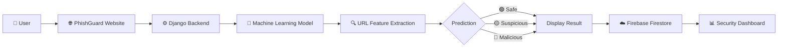

<div align="center">

# 🛡️ PhishGuard

### AI-Powered Phishing Website Detection Platform

<p align="center">
Protect yourself from phishing attacks with intelligent URL analysis powered by Machine Learning.
</p>

<p align="center">
<b>🔒 Verify Before You Trust</b>
</p>

<br>

<a href="https://phishguard.qzz.io/" target="_blank">

</a>

<a href="https://github.com/sovanshit/PhishGuard" target="_blank">

</a>

<a href="#">

</a>

<br><br>


</div>

---

# 🌐 Live Demo

<div align="center">

## 🚀 Experience PhishGuard Online

<a href="https://phishguard.qzz.io/" target="_blank">


</a>

<br><br>

### 🔗 https://phishguard.qzz.io/

</div>

---

# 📖 About PhishGuard

PhishGuard is an **AI-powered phishing detection platform** developed using **Python**, **Django**, **Machine Learning**, and **Firebase Firestore**.

The application analyzes website URLs using intelligent feature extraction and predicts whether a website is **Safe**, **Suspicious**, or **Malicious** before users interact with it.

Designed with a modern responsive interface, PhishGuard helps users identify phishing websites while providing detailed analytics through an interactive dashboard.

### Core Objectives

- Detect phishing websites accurately
- Protect users from cyber attacks
- Improve phishing awareness
- Provide real-time URL analysis
- Deliver a clean and responsive user experience

---

# ✨ Key Features

<table>

<tr>

<td width="50%">

## 🔍 URL Detection

- Real-Time URL Scanning
- Machine Learning Prediction
- URL Feature Analysis
- Threat Classification
- Instant Results

</td>

<td width="50%">

## 📊 Security Dashboard

- Scan Statistics
- Threat Distribution
- Weekly Analytics
- Search & Filters
- Export Reports

</td>

</tr>

<tr>

<td>

## 👤 User System

- Login
- Registration
- Profile Management
- Secure Authentication

</td>

<td>

## 🌐 Additional Features

- Browser Extension
- Responsive UI
- Dark Theme
- Fast Performance

</td>

</tr>

</table>

---

# ⚙️ Tech Stack

<div align="center">


</div>

<br>

| Category | Technologies |
|----------|--------------|
| 🎨 Frontend | HTML5 • CSS3 • JavaScript |
| ⚙️ Backend | Python • Django |
| 🤖 Machine Learning | Scikit-learn • Pandas • NumPy • Joblib |
| ☁️ Database | Firebase Firestore |
| 🔥 Firebase Services | Firebase Authentication • Cloud Firestore |
| 🛠️ Tools | Git • GitHub • VS Code |

---

# 🏗️ System Architecture



---

# 📂 Project Modules

| Module | Description |
|---------|-------------|
| 🏠 Home | Landing page introducing PhishGuard and phishing awareness |
| 🔐 Authentication | Secure Login & Registration using Firebase Authentication |
| 🔍 URL Scanner | Analyze URLs with Machine Learning |
| 📊 Dashboard | Visualize scan statistics and analytics |
| 📜 Scan History | Store and manage scanned URLs |
| 👤 Profile | User profile management |
| 🌐 Browser Extension | Scan websites directly while browsing |

---

# 📸 Project Screenshots

## 🏠 Home Page

The landing page introduces users to PhishGuard with a modern interface, quick navigation, and phishing awareness content.


---

## 🔐 Authentication

<table>

<tr>

<td>

### Login Page


</td>

<td>

### Registration Page


</td>

</tr>

</table>

---

## 🔍 URL Scanner

Users can enter any website URL to instantly check whether it is safe or malicious using the integrated Machine Learning model.

### Features

- One-click URL scanning
- Real-time prediction
- Threat classification
- Fast response
- Responsive interface


---

# 📊 Security Dashboard

The Security Dashboard provides users with a centralized overview of their phishing detection activity.

It presents important security insights through interactive charts, analytics, and historical scan records.

### Dashboard Highlights

| Feature | Description |
|---------|-------------|
| 📈 Statistics Cards | Total scans, Safe, Suspicious & Malicious URLs |
| 📉 Weekly Activity | Track daily scanning trends |
| 🥧 Threat Distribution | Pie chart visualization |
| 📜 Scan History | Complete URL history |
| 🔍 Search | Quickly search scanned URLs |
| 🎯 Filters | Safe / Suspicious / Malicious |
| 📤 Export Reports | Download scan history as CSV |
| 👤 User Card | Account information and statistics |


---

# 👤 Profile Management

Manage your account with an intuitive and secure profile dashboard.

Users can easily update personal information, manage their account, and view security-related statistics.

---

### Profile Features

| Feature | Description |
|---------|-------------|
| 👤 Profile Information | View and update personal details |
| 🔒 Password Management | Change password securely |
| 📧 Email Information | Display registered email |
| 📊 Personal Statistics | Total scans and account information |
| 🕒 Scan History | Access previous URL scans |
| 🗑️ Account Controls | Manage account settings |

<br>


---

# 🌐 Browser Extension

PhishGuard provides a browser extension that enables users to analyze websites instantly while browsing.

The extension communicates with the PhishGuard platform to provide quick phishing detection without opening the website manually.

---

## Supported Browsers

<div align="center">

| Chrome | Edge | Brave | Opera |
|:------:|:----:|:-----:|:-----:|
| ✅ | ✅ | ✅ | ✅ |

</div>

---

## Extension Features

| Feature | Description |
|---------|-------------|
| 🌐 Real-Time Website Detection | Scan URLs directly from the browser |
| ⚡ Instant Alerts | Warn users before opening malicious websites |
| 🛡️ Trust Indicator | Display website safety status |
| 🔄 Dashboard Sync | Sync scanned URLs with user dashboard |
| 🎯 Lightweight | Fast and optimized extension |

<br>


---

# ☁️ Firebase Integration

PhishGuard uses **Firebase** services to provide a secure and scalable cloud backend.

### Firebase Services Used

| Service | Purpose |
|----------|---------|
| 🔥 Firebase Authentication | User Login & Registration |
| ☁️ Cloud Firestore | Store scan history and user data |
| 🔐 Firebase Security Rules | Secure database access |

---

# 📂 Project Structure

```text
📦 PhishGuard
│
├── 📂 detector
│   ├── views.py
│   ├── urls.py
│   ├── models.py
│   ├── forms.py
│   └── admin.py
│
├── 📂 templates
│
├── 📂 static
│   ├── css
│   ├── js
│   ├── images
│   └── icons
│
├── 📂 media
│
├── 📂 ML_Model
│
├── 📂 firebase
│   ├── firebase_config.py
│   └── serviceAccountKey.json
│
├── 📜 manage.py
├── 📜 requirements.txt
└── 📜 README.md
```

---

# 🚀 Installation

### 1️⃣ Clone Repository

```bash
git clone https://github.com/sovanshit/PhishGuard.git
```

---

### 2️⃣ Navigate to Project

```bash
cd PhishGuard
```

---

### 3️⃣ Create Virtual Environment

```bash
python -m venv venv
```

---

### 4️⃣ Activate Environment

**Windows**

```bash
venv\Scripts\activate
```

**Linux / macOS**

```bash
source venv/bin/activate
```

---

### 5️⃣ Install Dependencies

```bash
pip install -r requirements.txt
```

---

### 6️⃣ Configure Firebase

Add your Firebase Admin SDK service account key.

Example:

```
firebase/
└── serviceAccountKey.json
```

Update the Firebase configuration before running the application.

---

### 7️⃣ Apply Migrations

```bash
python manage.py migrate
```

---

### 8️⃣ Run Development Server

```bash
python manage.py runserver
```

---

Open:

```
http://127.0.0.1:8000/
```

---

# 🔒 Security Features

| Feature | Description |
|---------|-------------|
| 🔍 URL Feature Extraction | Analyze URL structure and patterns |
| 🌐 Domain Validation | Verify suspicious domains |
| 🔐 HTTPS Verification | Detect secure connections |
| 🤖 Machine Learning Prediction | Identify phishing websites |
| 📊 Threat Classification | Safe / Suspicious / Malicious |
| 📜 Scan History | Store previous scans securely |
| 👤 Authentication | Secure user login with Firebase |

---

# 📈 Future Roadmap

| Feature | Status |
|----------|:------:|
| 📱 Android Application | 🚧 |
| 🍎 iOS Application | 🚧 |
| 📧 Email Phishing Detection | 🚧 |
| 🔗 QR Code Scanner | 🚧 |
| 🦊 Firefox Extension | 🚧 |
| 🤖 AI Security Assistant | 🚧 |
| 🌍 Multi-language Support | 🚧 |
| 📊 Admin Analytics Dashboard | 🚧 |

---

# 📊 Project Statistics

| Metric | Value |
|---------|------:|
| 💻 Frontend Pages | 7+ |
| 📊 Dashboard | Included |
| 🔍 URL Scanner | Included |
| 🌐 Browser Extension | Included |
| ☁️ Database | Firebase Firestore |
| 🔥 Firebase Authentication | Enabled |
| 🤖 Machine Learning | Integrated |
| 📱 Responsive Design | Yes |
| 🌙 Dark Theme | Yes |

---

# 🤝 Contributing

Contributions are welcome.

If you'd like to improve PhishGuard:

1. Fork the repository.
2. Create a new feature branch.
3. Commit your changes.
4. Push your branch.
5. Open a Pull Request.

---

# 👨‍💻 Developer

<div align="center">

## Sovan Shit

### Frontend Developer

Designed and developed the complete frontend experience of **PhishGuard**, focusing on a modern, responsive, and user-friendly interface.

</div>

---

## Responsibilities

- 🎨 Landing Page Design
- 🔐 Login & Registration UI
- 🔍 URL Scanner Interface
- 📊 Security Dashboard Design
- 👤 Profile Management
- 🌐 Browser Extension UI
- 📱 Responsive Design
- ✨ UI/UX Improvements

---

# 🏆 Key Highlights

- 🤖 AI-Powered Phishing Detection
- ☁️ Firebase Firestore Integration
- 🔥 Firebase Authentication
- 📊 Interactive Security Dashboard
- 🌐 Browser Extension Support
- 📱 Responsive Design
- 🌙 Modern Dark Theme
- ⚡ Fast URL Analysis
- 🛡️ Cybersecurity Focused Platform

---

# 🙏 Acknowledgements

Special thanks to the open-source community and technologies used in this project.

- Python
- Django
- Firebase
- Scikit-learn
- Pandas
- NumPy
- HTML5
- CSS3
- JavaScript
- GitHub
- VS Code

---

# 📄 License

This project is developed for **educational, research, and academic purposes**.

---

# 🌍 Live Demo

<div align="center">

## 🚀 Experience PhishGuard

<a href="https://phishguard.qzz.io/">

</a>

<br><br>

### 🔗 https://phishguard.qzz.io/

</div>

---

<div align="center">

# ⭐ Support This Project

If you found this project useful, please consider giving it a **⭐ Star** on GitHub.

Made with ❤️ by **Sovan Shit**

</div>
