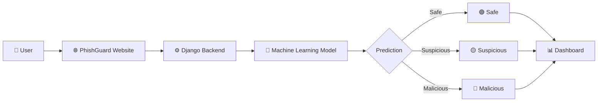

<div align="center">

# 🛡️ PhishGuard

### AI-Powered Phishing Website Detection Platform

Verify Before You Trust

Detect malicious websites using Machine Learning and protect users from phishing attacks in real-time.

<br>

<a href="https://phishguard.qzz.io/">
    
</a>

<a href="https://github.com/sovanshit/PhishGuard">
    
</a>

<a href="#">
    
</a>

<br><br>


</div>

---

## ⚙️ Tech Stack

<div align="center">


<br><br>

| Frontend | Backend | Machine Learning | Database |
|----------|----------|-----------------|-----------|
| HTML5 | Django | Scikit-learn | SQLite |
| CSS3 | Python | Pandas | |
| JavaScript | | NumPy | |
| Responsive UI | | Joblib | |

</div>

---

# 📖 About PhishGuard

PhishGuard is an AI-powered phishing detection platform developed using **Python**, **Django**, and **Machine Learning**.

The system analyzes URLs and classifies them as **Safe**, **Suspicious**, or **Malicious** using a trained Machine Learning model.

In addition to phishing detection, the platform provides an advanced security dashboard, scan history, profile management, browser extension support, and a modern responsive user interface.

Its primary objective is to help users identify malicious websites before sharing sensitive information online.

---

# ✨ Features

<table>

<tr>
<td>🔍 Real-Time URL Scanning</td>
<td>🤖 Machine Learning Detection</td>
</tr>

<tr>
<td>📊 Interactive Dashboard</td>
<td>📈 Threat Analytics</td>
</tr>

<tr>
<td>👤 User Authentication</td>
<td>🔐 Secure Login System</td>
</tr>

<tr>
<td>📜 Scan History</td>
<td>📤 CSV Export</td>
</tr>

<tr>
<td>🌐 Browser Extension</td>
<td>⚡ Fast Detection</td>
</tr>

<tr>
<td>📱 Responsive Design</td>
<td>🌙 Modern Dark UI</td>
</tr>

</table>

---

# 🏗️ System Architecture



---

# 📸 Project Gallery

## 🏠 Home Page


---

## 🔐 Authentication

| Login | Registration |
|-------|--------------|
|  |  |

---

## 🔍 URL Scanner


---

## 📊 Dashboard


---

## 👤 Profile


---

## 🌐 Browser Extension


---

---

# 👤 Profile Management

Manage your PhishGuard account with an intuitive profile dashboard.

### Features

| Feature | Description |
|---------|-------------|
| 👤 Update Profile | Edit personal information |
| 🔒 Change Password | Secure password update |
| 📧 Account Details | View account information |
| 📊 Scan Statistics | Total scans and membership |
| 🗑️ Clear History | Remove previous scan history |
| ❌ Delete Account | Permanently delete account |

<br>


---

# 🌐 Browser Extension

PhishGuard also includes a lightweight browser extension that provides phishing detection while browsing the web.

### Supported Browsers

<div align="center">

| Chrome | Edge | Brave | Opera |
|:------:|:----:|:-----:|:-----:|
| ✅ | ✅ | ✅ | ✅ |

</div>

---

### Extension Features

| Feature | Description |
|---------|-------------|
| ⚡ Auto Detection | Automatically scans visited websites |
| 🔔 Real-Time Alerts | Instant warning for phishing websites |
| 🛡️ Safety Badge | Shows website trust status |
| 🔄 Dashboard Sync | Connects directly with user dashboard |

---

### Installation Guide

1️⃣ Download the Extension

⬇️

2️⃣ Extract ZIP File

⬇️

3️⃣ Open Chrome Extensions

⬇️

4️⃣ Enable Developer Mode

⬇️

5️⃣ Click **Load Unpacked**

⬇️

6️⃣ Select Extension Folder

<br>


---

# 📁 Project Structure

```text
📦 PhishGuard
│
├── 📂 detector
│   ├── views.py
│   ├── urls.py
│   ├── models.py
│   ├── forms.py
│   └── admin.py
│
├── 📂 templates
│
├── 📂 static
│   ├── css
│   ├── js
│   ├── images
│   └── icons
│
├── 📂 media
│
├── 📂 ML_Model
│
├── 📜 manage.py
├── 📜 db.sqlite3
└── 📜 requirements.txt
```

---

# 🚀 Installation

## 1️⃣ Clone Repository

```bash
git clone https://github.com/sovanshit/PhishGuard.git
```

---

## 2️⃣ Navigate

```bash
cd PhishGuard
```

---

## 3️⃣ Create Virtual Environment

```bash
python -m venv venv
```

---

## 4️⃣ Activate Environment

Windows

```bash
venv\Scripts\activate
```

Linux / macOS

```bash
source venv/bin/activate
```

---

## 5️⃣ Install Dependencies

```bash
pip install -r requirements.txt
```

---

## 6️⃣ Database Migration

```bash
python manage.py migrate
```

---

## 7️⃣ Run Server

```bash
python manage.py runserver
```

---

## Visit

```
http://127.0.0.1:8000/
```

---

# 🔒 Security Features

| Security Feature | Description |
|------------------|-------------|
| 🔍 URL Analysis | Analyze URL structure and patterns |
| 🌐 Domain Verification | Validate trusted domains |
| 🔐 HTTPS Detection | Verify SSL encryption |
| 🤖 Machine Learning | Predict phishing probability |
| 📊 Threat Score | Security confidence score |
| 📜 Scan History | Save previous scans |
| 👤 Authentication | Secure user login |

---

# 📈 Future Roadmap

| Feature | Status |
|----------|--------|
| 📱 Android Application | 🚧 Planned |
| 🍎 iOS Application | 🚧 Planned |
| 📧 Email Phishing Detection | 🚧 Planned |
| 🌐 Firefox Extension | 🚧 Planned |
| 🤖 AI Chat Assistant | 🚧 Planned |
| ☁ Cloud Database | 🚧 Planned |
| 📊 Admin Dashboard | 🚧 Planned |
| 🔗 Threat Intelligence API | 🚧 Planned |

---

# 🤝 Contributing

Contributions are welcome.

```text
Fork Repository
        │
        ▼
Create Feature Branch
        │
        ▼
Commit Changes
        │
        ▼
Push Branch
        │
        ▼
Open Pull Request
```

---

# 📊 Project Highlights

| Metric | Value |
|---------|------:|
| 💻 Frontend Pages | 7+ |
| 📊 Dashboard | Included |
| 🔍 URL Scanner | Included |
| 🌐 Browser Extension | Included |
| 📱 Responsive Design | Yes |
| 🤖 Machine Learning | Enabled |
| 🔐 Authentication | Secure |
| 🎨 Dark Theme | Yes |

---

# 👨‍💻 Developer

<div align="center">

## Sovan Shit

**Frontend Developer**

Designed and developed the complete frontend experience of PhishGuard.

</div>

### Responsibilities

- 🎨 Landing Page Design
- 🔐 Login & Registration UI
- 🔍 URL Scanner Interface
- 📊 Dashboard Design
- 👤 Profile Management
- 🌐 Browser Extension UI
- 📱 Responsive Design
- ✨ User Experience Improvements

---

# 🙏 Acknowledgements

Special thanks to the open-source community and the technologies that made this project possible.

- Python
- Django
- Scikit-learn
- Pandas
- NumPy
- GitHub
- VS Code

---

# 📄 License

This project is developed for **educational and academic purposes**.

---

# 🌍 Live Demo

<div align="center">

## Try PhishGuard Online

<a href="https://phishguard.qzz.io/">


</a>

<br><br>

🔗 https://phishguard.qzz.io/

</div>

---

<div align="center">

## ⭐ Support the Project

If you found this project useful, consider giving it a **Star ⭐** on GitHub.

<br>

Made with ❤️ by **Sovan Shit**

</div>
