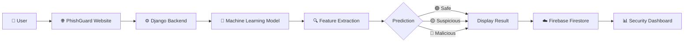
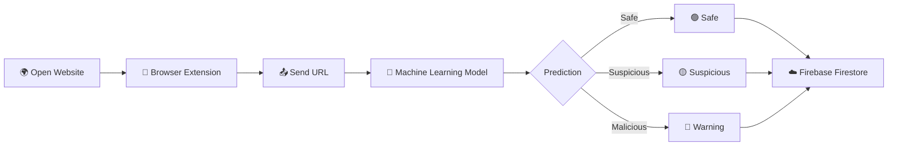
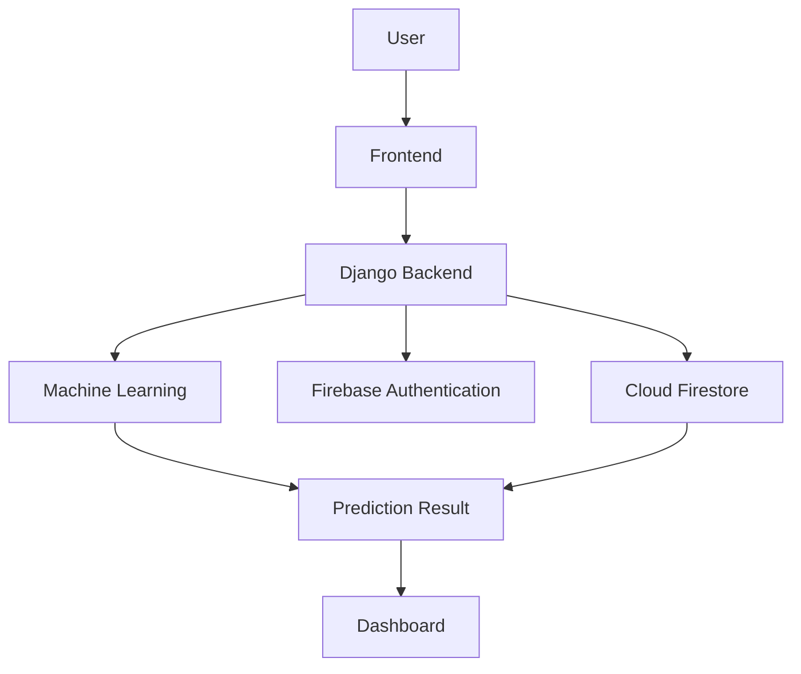

<div align="center">

# 🛡️ PhishGuard

### AI-Powered Phishing Website Detection Platform

Verify Before You Trust

Detect malicious websites using **Machine Learning**, **Django**, and **Firebase** before visiting them.

<br>

<a href="https://phishguard.qzz.io/">
    
</a>

<a href="https://github.com/sovanshit/PhishGuard">
    
</a>

<br><br>


</div>

---

# 🌐 Live Demo

Experience the live version of **PhishGuard** and test phishing URL detection in real time.

<div align="center">

<a href="https://phishguard.qzz.io/">


</a>

</div>

---

# 📖 About

**PhishGuard** is an AI-powered phishing website detection platform developed using **Python**, **Django**, **Machine Learning**, and **Firebase Firestore**.

The system analyzes website URLs using intelligent feature extraction and predicts whether a website is **Safe**, **Suspicious**, or **Malicious** before users interact with it.

The platform combines a modern user interface with machine learning to help users stay protected from phishing attacks while providing detailed security insights through an interactive dashboard.

---

## 🎯 Objectives

- Detect phishing websites accurately.
- Protect users from malicious URLs.
- Improve cybersecurity awareness.
- Provide real-time URL analysis.
- Deliver a clean and responsive user experience.

---

# ✨ Key Features

<table>

<tr>
<td width="50%">

### 🔍 Detection

- Real-Time URL Scanning
- Machine Learning Prediction
- URL Feature Extraction
- Instant Threat Detection
- Safe / Suspicious / Malicious Classification

</td>

<td width="50%">

### 📊 Dashboard

- Security Analytics
- Weekly Activity
- Threat Distribution
- Scan History
- CSV Export

</td>
</tr>

<tr>
<td>

### 👤 User Management

- Secure Login
- User Registration
- Firebase Authentication
- Profile Management
- Password Update

</td>

<td>

### 🌐 Additional Features

- Browser Extension
- Responsive Design
- Modern Dark Theme
- Fast Performance
- Mobile Friendly

</td>
</tr>

</table>

---

# ⚙️ Tech Stack

<div align="center">


<br><br>

| Frontend | Backend | Machine Learning | Database |
|-----------|----------|------------------|-----------|
| HTML5 | Django | Scikit-learn | Firebase Firestore |
| CSS3 | Python | Pandas | |
| JavaScript | | NumPy | |
| Responsive UI | | Joblib | |

</div>

---

# 🚀 Project Workflow



---

# 📂 Project Modules

| Module | Description |
|---------|-------------|
| 🏠 Home | Modern landing page introducing PhishGuard and cybersecurity awareness. |
| 🔐 Authentication | Secure Login and Registration using Firebase Authentication. |
| 🔍 URL Scanner | Scan and analyze website URLs using the Machine Learning model. |
| 📊 Dashboard | View security analytics, charts, statistics, and scan history. |
| 👤 Profile | Manage account information and application settings. |
| 🌐 Browser Extension | Detect phishing websites directly while browsing. |

---

## 📌 Core Functionalities

- ✅ AI-powered phishing website detection
- ✅ Real-time URL scanning
- ✅ Interactive analytics dashboard
- ✅ Firebase Authentication
- ✅ Firebase Firestore database
- ✅ Browser Extension support
- ✅ Scan History Management
- ✅ Export Reports
- ✅ Responsive UI
- ✅ Modern Dark Theme

---

# 📸 Project Screenshots

A quick overview of the PhishGuard interface and its major modules.

---

## 🏠 Home Page

The landing page introduces PhishGuard with a clean cyber-inspired interface, highlights the platform's features, and provides quick access to URL scanning and the security dashboard.


---

## 🔐 Authentication

Secure authentication system powered by **Firebase Authentication**.

<table>
<tr>

<td width="50%">

### Login


</td>

<td width="50%">

### Registration


</td>

</tr>
</table>

---

## 🔍 URL Scanner

The URL Scanner allows users to instantly verify whether a website is safe or malicious using the integrated Machine Learning model.

### Scanner Features

- Real-Time URL Analysis
- Machine Learning Prediction
- Safety Classification
- Instant Response
- Scan History Integration


---

# 📊 Security Dashboard

The Security Dashboard is the core module of PhishGuard, providing users with complete visibility into their phishing detection activities.

It combines analytics, charts, historical records, and account information into a modern dashboard.


---

## Dashboard Overview

### 📈 Statistics Cards

The dashboard displays key security metrics at a glance.

| Card | Purpose |
|------|---------|
| 🔍 Total Scans | Number of scanned URLs |
| 🟢 Safe URLs | Legitimate websites detected |
| 🟡 Suspicious | URLs requiring attention |
| 🔴 Malicious | Confirmed phishing websites |

---

### 📉 Activity Graph

Monitor URL scanning activity over the last seven days.

Features include:

- Daily Scan Trend
- Safe URL Count
- Suspicious URL Count
- Malicious URL Count

---

### 🥧 Threat Distribution

Visual pie chart showing the percentage of:

- 🟢 Safe URLs
- 🟡 Suspicious URLs
- 🔴 Malicious URLs

This helps users quickly understand the security status of scanned websites.

---

### 📜 Scan History

Every scanned URL is stored in Firestore and displayed inside the dashboard.

Information includes:

- URL
- Detection Status
- Security Score
- Scan Date
- Scan Time

---

### 🔍 Search & Filter

Users can quickly locate previous scans using:

- Search Box
- All Filter
- Safe Filter
- Suspicious Filter
- Malicious Filter

---

### 📤 Export Reports

Scan history can be exported for reporting and future analysis.

Supported format:

- CSV

---

### 👤 User Information

Dashboard also displays:

- Profile Avatar
- User Name
- Email Address
- Account Type

---

## Dashboard Highlights

| Feature | Status |
|---------|:------:|
| Statistics Cards | ✅ |
| Activity Chart | ✅ |
| Threat Distribution | ✅ |
| Search & Filter | ✅ |
| Scan History | ✅ |
| CSV Export | ✅ |
| User Overview | ✅ |
| Responsive Design | ✅ |

---

> 📌 The Security Dashboard acts as the central monitoring interface, allowing users to analyze phishing threats, review previous scans, and manage their security information through a clean and interactive experience.

---

# 👤 Profile Management

The Profile module allows users to manage their personal information and customize their PhishGuard account in a secure environment.

It provides quick access to account settings, profile details, and security preferences.


---

## Profile Features

| Feature | Description |
|---------|-------------|
| 👤 Profile Information | View and update personal details |
| 📧 Email Details | Registered email address |
| 🔒 Password Management | Secure password updates |
| 📊 Personal Statistics | View total scans and account activity |
| 🗑️ Clear History | Remove scan history |
| ⚙️ Account Settings | Manage profile preferences |

---

## Why Profile Management?

- Keep account information updated.
- Securely manage user credentials.
- Access personalized dashboard statistics.
- Improve overall user experience.

---

# 🌐 Browser Extension

PhishGuard includes a lightweight browser extension that enables users to check website safety instantly while browsing.

The extension communicates with the PhishGuard platform to provide real-time phishing detection without manually opening the web application.


---

## Supported Browsers

<div align="center">

| Chrome | Edge | Brave | Opera |
|:------:|:----:|:-----:|:-----:|
| ✅ | ✅ | ✅ | ✅ |

</div>

---

## Extension Features

| Feature | Description |
|---------|-------------|
| 🌐 Automatic URL Detection | Detects the currently opened website |
| ⚡ Real-Time Analysis | Checks URLs instantly |
| 🔔 Instant Warning | Alerts users before opening phishing websites |
| 🛡️ Security Indicator | Displays website safety status |
| 🔄 Dashboard Synchronization | Saves scan history to Firestore |

---

## Browser Extension Workflow



---

# ☁️ Firebase Integration

PhishGuard uses **Firebase** to provide secure authentication and cloud-based data storage.

Firebase enables users to securely access the application while synchronizing scan history across sessions.

---

## Firebase Services

| Service | Purpose |
|----------|---------|
| 🔐 Firebase Authentication | User Login & Registration |
| ☁️ Cloud Firestore | Store user information and scan history |
| 🔥 Firebase SDK | Communication between application and cloud |

---

## Benefits of Firebase

- Secure Authentication
- Cloud-Based Database
- Fast Data Synchronization
- Scalable Infrastructure
- Reliable Performance

---

# 📂 Project Structure

```text
📦 PhishGuard
│
├── 📂 detector
│   ├── admin.py
│   ├── forms.py
│   ├── models.py
│   ├── urls.py
│   ├── views.py
│   └── utils.py
│
├── 📂 templates
│
├── 📂 static
│   ├── css
│   ├── js
│   ├── images
│   └── icons
│
├── 📂 media
│
├── 📂 ML_Model
│
├── 📂 firebase
│   ├── firebase_config.py
│   └── serviceAccountKey.json
│
├── 📜 manage.py
├── 📜 requirements.txt
└── 📜 README.md
```

---

## Project Architecture



---

## Folder Description

| Folder | Description |
|---------|-------------|
| 📂 detector | Core Django application |
| 📂 templates | HTML templates |
| 📂 static | CSS, JavaScript, Images |
| 📂 media | Uploaded media files |
| 📂 ML_Model | Trained Machine Learning model |
| 📂 firebase | Firebase configuration files |

---

> 📌 This modular project structure improves scalability, maintainability, and simplifies future feature development.

---

# 🚀 Installation

Follow these steps to run **PhishGuard** locally.

## 1️⃣ Clone the Repository

```bash
git clone https://github.com/sovanshit/PhishGuard.git
```

---

## 2️⃣ Navigate to the Project

```bash
cd PhishGuard
```

---

## 3️⃣ Create a Virtual Environment

```bash
python -m venv venv
```

---

## 4️⃣ Activate the Environment

### Windows

```bash
venv\Scripts\activate
```

### Linux / macOS

```bash
source venv/bin/activate
```

---

## 5️⃣ Install Dependencies

```bash
pip install -r requirements.txt
```

---

## 6️⃣ Configure Firebase

Create a Firebase project and download your **Service Account Key**.

Place the file inside:

```text
firebase/
└── serviceAccountKey.json
```

Update the Firebase configuration inside `firebase_config.py`.

---

## 7️⃣ Apply Database Migrations

```bash
python manage.py migrate
```

---

## 8️⃣ Run Development Server

```bash
python manage.py runserver
```

---

Open your browser and visit:

```text
http://127.0.0.1:8000/
```

---

# 🔒 Security Features

PhishGuard is designed to improve user safety by combining Machine Learning with secure web technologies.

| Feature | Description |
|---------|-------------|
| 🔍 URL Feature Extraction | Analyze URL patterns and characteristics |
| 🌐 Domain Validation | Detect suspicious domains |
| 🔐 HTTPS Verification | Verify secure website connections |
| 🤖 Machine Learning Detection | Predict phishing probability |
| 📊 Threat Classification | Safe / Suspicious / Malicious |
| 📜 Scan History | Store previous scans securely |
| 🔥 Firebase Authentication | Secure user authentication |
| ☁️ Cloud Firestore | Secure cloud database storage |

---

# 📈 Future Roadmap

The following features are planned for future releases.

| Feature | Status |
|---------|:------:|
| 📱 Android Application | 🚧 Planned |
| 🍎 iOS Application | 🚧 Planned |
| 🌐 Firefox Extension | 🚧 Planned |
| 📧 Email Phishing Detection | 🚧 Planned |
| 📷 QR Code Scanner | 🚧 Planned |
| 🤖 AI Security Assistant | 🚧 Planned |
| 🌍 Multi-language Support | 🚧 Planned |
| 📊 Admin Analytics Dashboard | 🚧 Planned |
| 🔗 Threat Intelligence API | 🚧 Planned |

---

# 📊 Project Statistics

| Metric | Value |
|---------|------:|
| 💻 Frontend Pages | 7+ |
| 📊 Dashboard | Included |
| 🔍 URL Scanner | Included |
| 👤 Authentication | Firebase |
| ☁️ Database | Firebase Firestore |
| 🤖 Machine Learning | Integrated |
| 🌐 Browser Extension | Included |
| 📱 Responsive Design | Yes |
| 🌙 Dark Theme | Yes |

---

# 🤝 Contributing

Contributions are always welcome.

### Contribution Workflow

```text
Fork Repository
        │
        ▼
Create Feature Branch
        │
        ▼
Commit Changes
        │
        ▼
Push Branch
        │
        ▼
Open Pull Request
```

---

# 👨‍💻 Developer

<div align="center">

## Sovan Shit

### Frontend Developer

Focused on designing a modern, responsive, and user-friendly interface for **PhishGuard**.

</div>

---

### Responsibilities

- 🎨 Landing Page Design
- 🔐 Login & Registration UI
- 🔍 URL Scanner Interface
- 📊 Security Dashboard
- 👤 Profile Management
- 🌐 Browser Extension UI
- 📱 Responsive Design
- ✨ UI/UX Improvements

---

# 🏆 Project Highlights

- 🛡️ AI-Powered Phishing Detection
- 🤖 Machine Learning Integration
- ☁️ Firebase Firestore Database
- 🔐 Firebase Authentication
- 📊 Interactive Dashboard
- 🌐 Browser Extension
- 📱 Fully Responsive UI
- 🌙 Modern Dark Theme
- ⚡ Fast URL Analysis
- 🔒 Secure User Authentication

---

# 🙏 Acknowledgements

Special thanks to the amazing open-source technologies that made this project possible.

- Python
- Django
- Firebase
- Scikit-learn
- Pandas
- NumPy
- HTML5
- CSS3
- JavaScript
- GitHub
- VS Code

---

# 📄 License

This project is developed for **educational, research, and academic purposes**.

Feel free to use this project for learning and non-commercial purposes.

---

# 🌍 Live Website

Visit the deployed version of **PhishGuard**.

<div align="center">

<a href="https://phishguard.qzz.io/">


</a>

</div>

---

<div align="center">

## ⭐ Support the Project

If you found this project helpful, consider giving it a **⭐ Star** on GitHub.

<br>

Made with ❤️ by **Sovan Shit**

</div>
